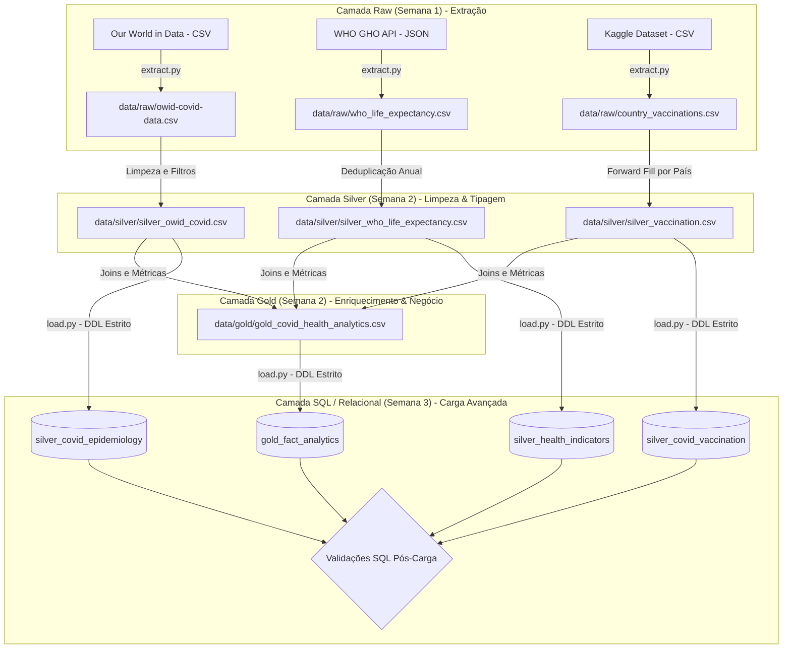
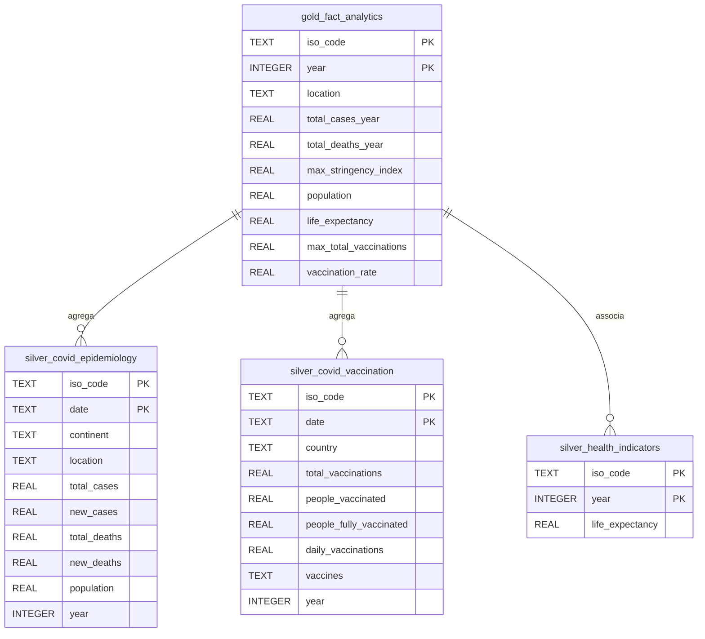

# Projeto de ETD: Saúde e Saúde Pública

Este projeto consiste no desenvolvimento de um pipeline ETL (Extract, Transform, Load) modular focado no domínio da Saúde & Saúde Pública. O objetivo principal é a consolidação de dados de múltiplas fontes para analisar correlações entre indicadores de saúde pública, propagação da COVID-19 e coberturas vacinais globais.

A arquitetura segue o princípio de **Medallion Architecture** (Raw ➔ Silver ➔ Gold), garantindo a rastreabilidade e qualidade dos dados e garante a rastreabilidade, integridade estrutural e qualidade dos dados através da aplicação de regras estritas de validação, culminando no carregamento automatizado dos dados para um sistema relacional local (**SQLite**).

---

## Arquitetura do Pipeline

---

# 2. Modelação da Base de Dados (Diagrama ER)

Os dados processados foram carregados para SQLite. Para assegurar a integridade analítica, foram definidas chaves primárias compostas e tipos de dados estritos.

---

## Prova da Validação

2026-05-29 22:03:03,296 - INFO - === INÍCIO DA ETAPA: LOAD AVANÇADO (SEMANA 3) ===
2026-05-29 22:03:03,340 - INFO - Tabela estruturada com sucesso: silver_covid_epidemiology (Esquema estrito aplicado).
2026-05-29 22:03:03,359 - INFO - Tabela estruturada com sucesso: silver_covid_vaccination (Esquema estrito aplicado).
2026-05-29 22:03:03,367 - INFO - Tabela estruturada com sucesso: silver_health_indicators (Esquema estrito aplicado).
2026-05-29 22:03:03,375 - INFO - Tabela estruturada com sucesso: gold_fact_analytics (Esquema estrito aplicado).
c:\Users\IG\Desktop\projeto_etd\script\load.py:97: DtypeWarning: Columns (33) have mixed types. Specify dtype option on import or set low_memory=False.
  df = pd.read_csv(csv_path)
2026-05-29 22:03:06,123 - INFO - Dados inseridos em 'silver_covid_epidemiology': 393903 linhas carregadas do CSV.
2026-05-29 22:03:06,578 - INFO - Dados inseridos em 'silver_covid_vaccination': 84056 linhas carregadas do CSV.
2026-05-29 22:03:06,594 - INFO - Dados inseridos em 'silver_health_indicators': 4070 linhas carregadas do CSV.
2026-05-29 22:03:06,608 - INFO - Dados inseridos em 'gold_fact_analytics': 925 linhas carregadas do CSV.
2026-05-29 22:03:06,609 - INFO - --- A iniciar Validações Pós-Carga (Data Quality SQL) ---
2026-05-29 22:03:06,609 - INFO - [SUCESSO] Sem Chaves Primárias nulas na camada Gold.
2026-05-29 22:03:06,633 - INFO - [SUCESSO] Integridade Referencial validada: todos os países mapeados existem nas origens.
2026-05-29 22:03:06,633 - INFO - [SUCESSO] Sem anomalias severas detetadas nas métricas calculadas.
2026-05-29 22:03:06,634 - INFO - === [CONCLUÍDO] Todos os testes de qualidade SQL passaram com distinção! ===
2026-05-29 22:03:06,634 - INFO - === Conexão à Base de Dados SQLite encerrada de forma segura ===