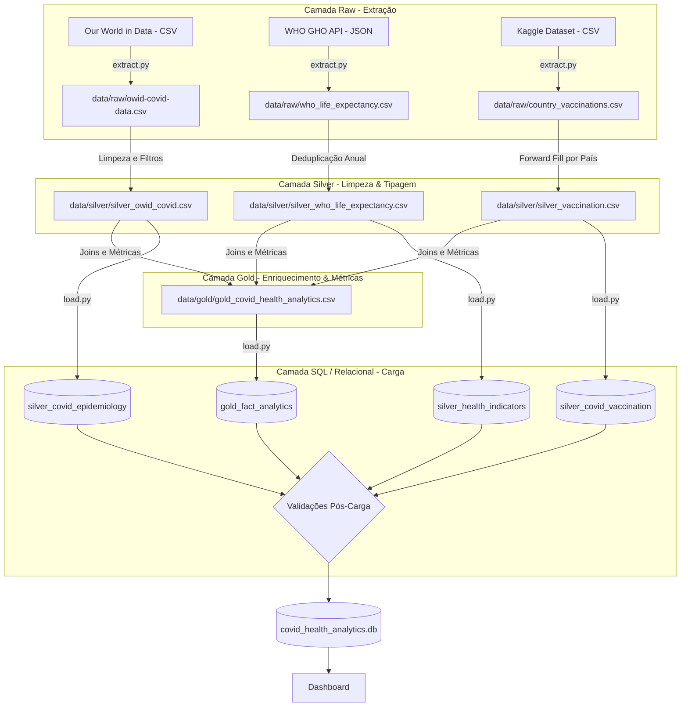
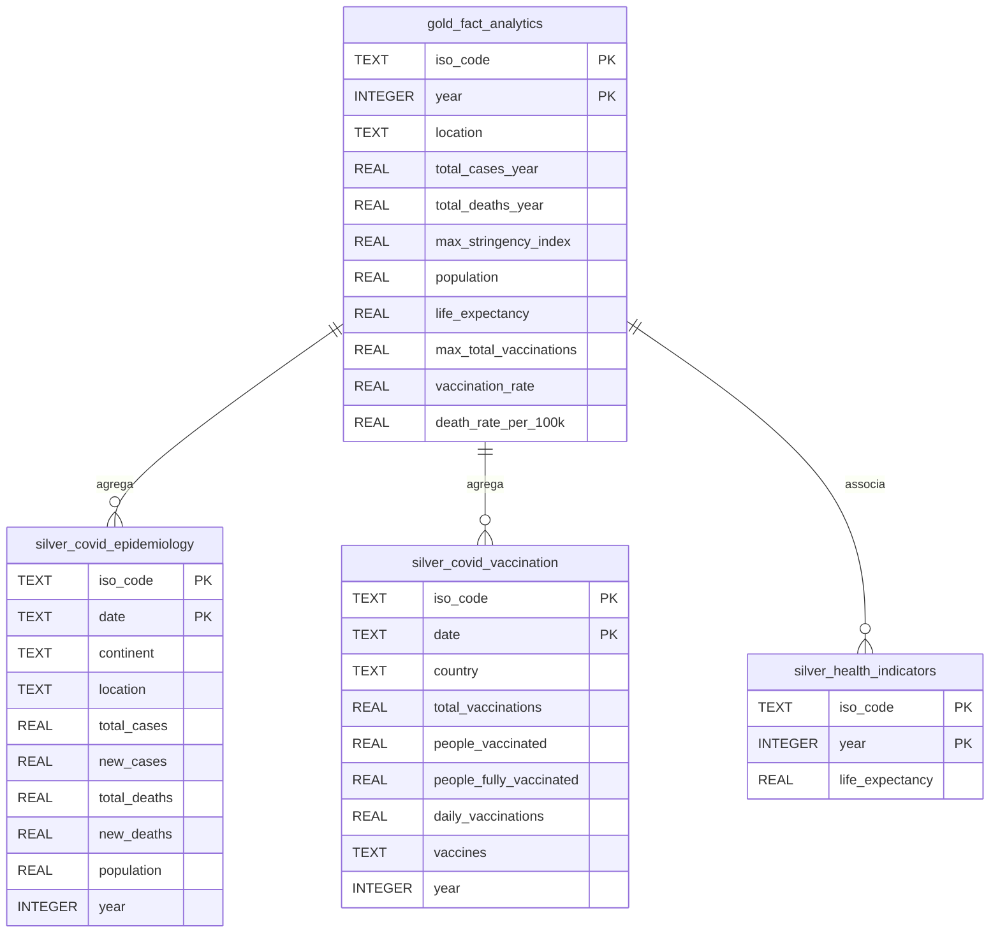

# Projeto ETL: Saúde & Saúde Pública

Pipeline ETL modular focado no domínio da Saúde Pública, que consolida dados epidemiológicos da COVID-19, taxas de vacinação global e indicadores de esperança de vida para análise de correlações e impacto.

A arquitetura segue o princípio de **Medallion Architecture** (Raw → Silver → Gold), garantindo rastreabilidade, integridade estrutural e qualidade dos dados através de regras estritas de validação, culminando no carregamento automatizado para uma base de dados **SQLite** local.

---

## Índice

1. [Fontes de Dados](#fontes-de-dados)
2. [Arquitetura do Pipeline](#arquitetura-do-pipeline)
3. [Modelação da Base de Dados](#modelação-da-base-de-dados-diagrama-er)
4. [Estrutura do Repositório](#estrutura-do-repositório)
5. [Instalação e Configuração](#instalação-e-configuração)
6. [Execução do Pipeline](#execução-do-pipeline)
7. [Dashboard](#dashboard)
8. [Qualidade de Dados](#qualidade-de-dados)
9. [Limitações](#limitações)

---

## Fontes de Dados

| Fonte | Tipo | Descrição |
|---|---|---|
| [Our World in Data — COVID-19](https://github.com/owid/covid-19-data) | CSV (dataset volumoso) | Dados epidemiológicos diários por país (casos, mortes, stringency index) |
| [WHO GHO API](https://www.who.int/data/gho/info/gho-odata-api) | API REST (JSON) | Indicadores globais de esperança de vida por país e ano |
| [Kaggle — COVID-19 World Vaccination Progress](https://www.kaggle.com/datasets/gpreda/covid-world-vaccination-progress) | CSV complementar | Dados de vacinação diários por país |

**Chave de integração entre fontes:** `iso_code` (código ISO 3166-1 alpha-3)

---

## Arquitetura do Pipeline



---

## Modelação da Base de Dados (Diagrama ER)



---

## Estrutura do Repositório

```
projeto_etd/
│
├── script/
│   ├── extract.py           # Semana 1 — extração das 3 fontes
│   ├── transform.py         # Semana 2 — limpeza, silver, gold, data quality
│   ├── load.py              # Semana 3 — carga para SQLite com validação
│   └── dashboard.py         # Semana 4 — dashboard interativo
│
├── data/
│   ├── raw/                 # Dados brutos (não versionados)
│   ├── silver/              # Dados limpos (não versionados)
│   └── gold/                # Dados analíticos (não versionados)
│
├── .env                     # Variáveis de ambiente (não versionado)
├── .env.example             # Template de configuração
├── .gitignore
├── requirements.txt
├── data_quality_report.txt  # Gerado por transform.py
├── load_validation_report.txt  # Gerado por load.py
└── README.md
```

---

## Instalação e Configuração

### Pré-requisitos

- Python 3.10+
- pip

### 1. Clonar o repositório

```bash
git clone <url-do-repositorio>
cd projeto_etd
```

### 2. Criar e ativar ambiente virtual

```bash
python -m venv venv

# Windows
venv\Scripts\activate

# macOS / Linux
source venv/bin/activate
```

### 3. Instalar dependências

```bash
pip install -r requirements.txt
```

### 4. Configurar variáveis de ambiente

```bash
cp .env.example .env
```

O ficheiro `.env` não requer alterações para execução local com as configurações padrão.

### 5. Obter os datasets

Os ficheiros raw não estão no repositório (volume elevado). Descarregar e colocar em `data/raw/`:

- **OWID COVID-19:** https://github.com/owid/covid-19-data → `owid-covid-data.csv`
- **Vacinação Kaggle:** https://www.kaggle.com/datasets/gpreda/covid-world-vaccination-progress → `country_vaccinations.csv`
- **WHO Life Expectancy:** gerado automaticamente pelo `extract.py` via API

---

## Execução do Pipeline

Executar os scripts pela seguinte ordem a partir da raiz do projeto:

```bash
# Semana 1 — Extração
python script/extract.py

# Semana 2 — Transformação + Data Quality
python script/transform.py

# Semana 3 — Carga para SQLite
python script/load.py

# Semana 4 — Dashboard
streamlit run script/dashboard.py
```

Cada script gera logs no terminal e, quando aplicável, ficheiros de relatório na raiz do projeto.

---

## Dashboard

O dashboard é construído em **Streamlit** e liga diretamente à base de dados SQLite gerada pelo `load.py`.

Para lançar:

```bash
streamlit run script/dashboard.py
```

Perguntas analíticas respondidas pelo dashboard:

- Como evoluiu a taxa de mortalidade por país ao longo do tempo?
- Existe correlação entre taxa de vacinação e mortalidade por 100k habitantes?
- Como a esperança de vida se relaciona com o impacto da COVID-19?
- Que países tiveram maior e menor cobertura vacinal?

---

## Qualidade de Dados

O pipeline produz dois relatórios automáticos:

- **`data_quality_report.txt`** — gerado por `transform.py`, cobre nulos, duplicados, intervalos de datas e integração entre fontes
- **`load_validation_report.txt`** — gerado por `load.py`, cobre contagens pós-carga, integridade referencial e índices criados

Resumo dos dados após transformação:

| Dataset | Registos | Países | Período |
|---|---|---|---|
| OWID COVID-19 | 393 903 | 237 | 2020-01-01 → 2024-08-14 |
| WHO Life Expectancy | 4 070 | 185 | 2000 → 2021 |
| Vacinação COVID | 84 056 | 217 | 2020-12-02 → 2022-03-29 |
| Gold Analytics | 925 | 181 | 2020 → 2024 |

---

## Limitações

- Os dados de vacinação (Kaggle) têm cobertura até março de 2022, não refletindo campanhas posteriores.
- A esperança de vida da WHO cobre até 2021, pelo que o cruzamento com dados COVID mais recentes usa o último valor disponível por país.
- 20 países com dados COVID não têm dados de vacinação — retidos via left join com valores nulos nessas colunas.
- O pipeline foi desenhado para execução local; para volumes maiores recomenda-se migração para DuckDB ou PostgreSQL.